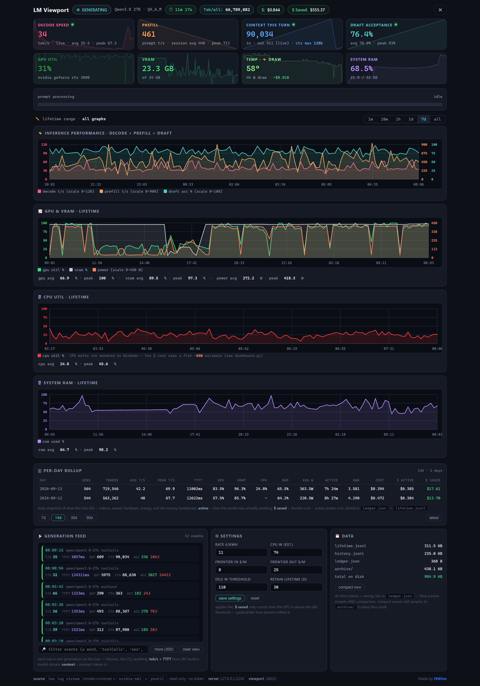
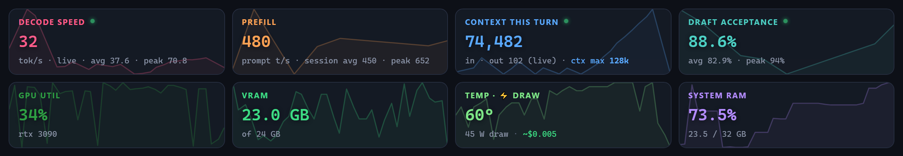
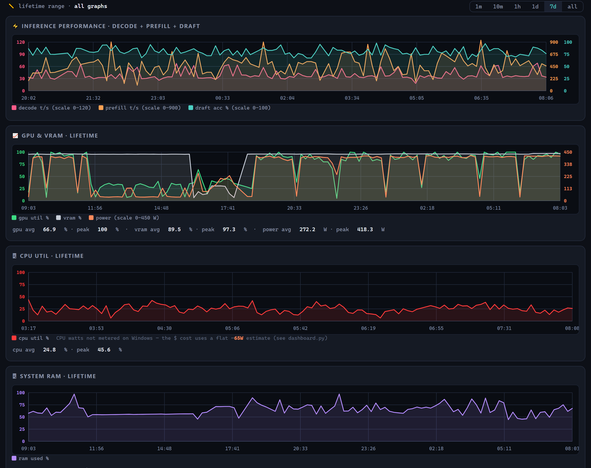
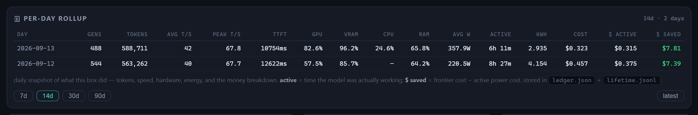
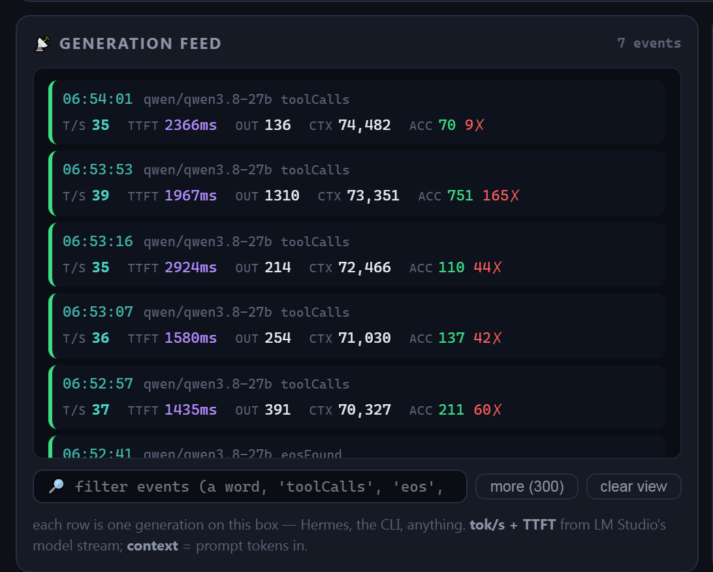
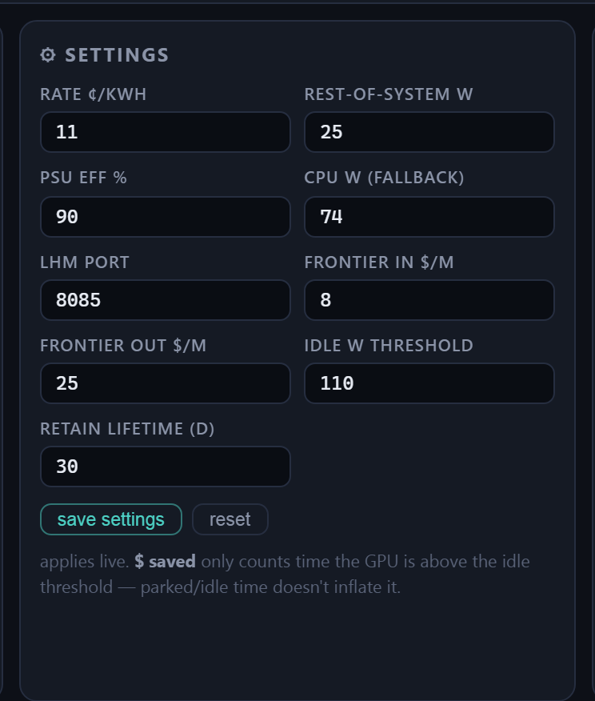
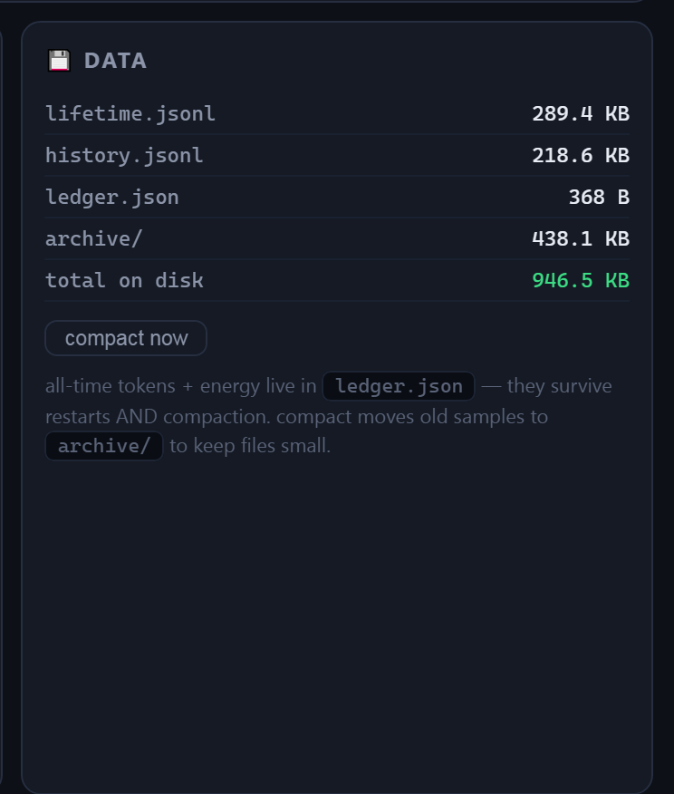

<div align="center">

# LM Viewport

**A live, read-only telemetry dashboard for your local LM Studio inference server.**

`Python` · `no API token` · `no second model` · `local-only` · `MIT`

[]()
[]()
[]()

</div>

---

LM Viewport sits next to your running LM Studio server and turns its already-
emitted logs into a real-time cockpit: decode/prefill speed, draft acceptance,
GPU/VRAM/temperature/draw, system RAM, prompt-progress, plus **lifetime charts**,
a **per-day rollup with energy + cost + $-saved**, and a scrolling **generation
feed**. It accumulates a durable all-time ledger so your totals survive restarts.

It is **strictly read-only** — it never loads a model, never sends a prompt, and
never touches a token. It reads LM Studio's own local `lms` log streams,
`nvidia-smi`, and (optionally) `psutil`, all on `127.0.0.1`.

> The numbers in the screenshots below are the author's own telemetry (real
> tokens, watts, and dollars from their machine). Yours will be different —
> the layout is what to expect.

## The whole dashboard



Everything on one screen: header status bar, live tiles with sparklines, a
prompt-progress bar, four lifetime charts, a per-day rollup table, the
generation feed, and live-editable settings + data panels.

## Quick start

### Requirements
- **LM Studio** installed — the dashboard works whether the app is **open or closed**: it reports `OFFLINE` when the app is down and keeps showing GPU / RAM / energy either way (you can leave it running for non-AI monitoring)
- **Python 3.8+** on your `PATH`
- **NVIDIA GPU** (for the GPU/VRAM/temp/draw tiles via `nvidia-smi`) — optional but recommended
- **`psutil`** (optional) — enables the *System RAM* tile. Without it that one tile is hidden and everything else works.

### Install
```bash
git clone https://github.com/NWinnVR/lmstudio-viewport.git
cd lmstudio-viewport

# optional — enables the system RAM tile
pip install psutil
```

### Run
**Windows:** double-click **`run_viewport.bat`** (starts windowless, no console left open).

**Linux / macOS:**
```bash
./run.sh          # or: python3 dashboard.py
```

Then open **http://127.0.0.1:18022** in your browser.

To stop it: click the **✖** button in the viewport header (your model/server keeps running), or `pkill -f dashboard.py`.

> **First run is instant.** The dashboard starts empty and fills in as LM
> Studio emits events. The *lifetime* charts and *per-day rollup* populate
> over time — they're cumulative logs, not live probes.

---

## Tour

### Header · status, model, uptime, totals


Left to right: the **status pill**, the **loaded model**, how long it's been
loaded, **all-time tokens**, **all-time electricity cost**, and **$ Saved**
(estimated savings vs. running the same tokens on a frontier API, counted only
while the GPU was actively working).

The pill has **three states** plus a live one:

| Pill | Meaning |
|---|---|
| 🟩 `READY` / `GENERATING` | model loaded — idle / actively producing |
| 🟧 `RUNNING · no model` | LM Studio is open but nothing is loaded |
| 🟥 `LM STUDIO OFFLINE` | the app is closed |

…and the **model label** beside it updates to whatever is actually loaded,
clearing to *no model loaded* when nothing is (it never shows a stale model).

### Live tiles · the real-time needles


Eight tiles, each with a faint **sparkline** of its own last few minutes behind
the number:

| Tile | What it is |
|---|---|
| **Decode speed** | live tokens/sec while generating — the headline speed |
| **Prefill** | how fast the prompt is read in (tokens/sec) |
| **Context this turn** | tokens in this generation + your max context window |
| **Draft acceptance** | spec-decoding: % of draft tokens the big model accepted |
| **GPU util** | nvidia-smi utilization % — the **card name is auto-detected** (your GPU, not a hardcoded one) |
| **VRAM** | memory in use / total |
| **Temp · ⚡ Draw** | GPU temperature + live power draw (the only tile with the bolt) |
| **System RAM** | via `psutil` (optional) |

Counters flush to **0 when the model is idle** (rather than freezing on the last
value), and the little `avg` / `peak` figures are computed **only over active
generation time** — idle time never drags them down.

### Prompt progress
A thin progress bar under the tiles tracks **prompt processing** (prefill) live.
It reads `idle` between prompts and fills while a long prompt is being read in.

### Lifetime charts · the long view


Four line charts over any range (**1m / 10m / 1h / 1d / 7d / all**),
each with avg + peak in the legend:

- **Inference performance** — decode + prefill + draft acceptance
- **GPU & VRAM** — utilization, VRAM %, and power draw
- **CPU util** — utilization (CPU watts aren't metered on Windows, so a flat
  platform estimate is folded into the energy math instead)
- **System RAM** — memory % over time

### Per-day rollup · the money shot


A daily table of what the box actually did — generations, tokens, avg/peak
speed, TTFT, GPU/VRAM/CPU/RAM, average draw, **active time**, **kWh**,
**cost**, **$ active**, and **$ saved**. Pick the range (7d / 14d / 30d / 90d).
`active` = time the model was actually working (GPU above your idle threshold);
`$ saved` = frontier cost − active power cost.

### Generation feed · the log


A scrolling feed of recent generations — timestamp, model, tokens/sec, TTFT,
output length, context, and draft acceptance. Filter, load more, or clear the
view. This is your event-level record.

### Settings · live-tweakable knobs


Edit your numbers without restarting: **electricity rate** (¢/kWh), **CPU
wattage estimate**, **frontier in/out** ($/M) used for `$ saved`, the **idle
watt threshold** (what counts as "working"), and how many **days** of lifetime
data to keep live before compacting to an archive. Changes save to
`settings.json` immediately.

### Data · what's on disk


Live file sizes for the log/ledger files, the archive size, total on disk, and a
**compact now** button that rotates old samples to `archive/` (your durable
all-time ledger stays correct across compaction).

---

## How it works

LM Viewport never calls the inference API. It taps the **local, read-only**
streams LM Studio is already producing:

| Source | Gives us |
|---|---|
| `lms log stream --source model` | generation events (tok/s, TTFT, context, draft) |
| `lms log stream --source runtime` | llama.cpp timings (prefill t/s, prompt progress, decode ticks) |
| `lms server status` / `lms ps` | server up/down, loaded model, context, queue |
| `nvidia-smi` | GPU util / VRAM / temp / power draw |
| `psutil` *(optional)* | system RAM |

Everything is local, argument-list subprocesses (no shell strings), and the
process is windowless so it sits quietly in the background.
It binds to **127.0.0.1 only** by default — nothing is exposed to your network
unless you turn on [phone / LAN mode](#phone--lan-optional) below.

**It can never relaunch the app.** Every `lms` call is gated behind a passive
TCP probe to LM Studio's port `:1234` — a socket connect can't start a process.
So with the app closed the dashboard makes **zero** `lms` invocations (which is
exactly what used to wake the LM Studio GUI) and simply reports `OFFLINE`.
Keep the viewport open all day for GPU/RAM/energy monitoring and it will never
pop the app back up.

### Privacy by design
- No API key, no cloud, no telemetry sent anywhere.
- All data (logs, ledger, settings, archives) stays in the project folder.
- The server listens on `127.0.0.1` only by default (opt-in LAN mode is
  private-profile + token-gated — never internet-facing).
- Everything the dashboard writes is git-ignored by default — clone the repo,
  run it, and your personal numbers never leave your machine.

## Phone / LAN (optional)

Open the dashboard on your phone or any device on your home network. It's
**off by default** — the viewport stays `127.0.0.1`-only until you turn it on,
and it **never goes to the internet** (the firewall rule is private-profile only).

**How it's secured:** read-only stats are open to the LAN, but the three *write*
buttons (save settings · compact · close) are gated by a **write token**. Anyone
on the network can look at your telemetry; only a device that has the token can
press a button.

### Enable it (2 steps)
1. In the dashboard, open the **📱 phone / LAN** card (settings drawer) and click
   **enable phone mode**. This generates a token, binds the viewport to the LAN,
   and shows the LAN url + the firewall command.
2. Run the shown command **once, in an admin prompt** (it opens the port to your
   home network only):
   ```
   netsh advfirewall firewall add rule name="Viewport-18022" dir=in action=allow protocol=TCP localport=18022 remoteip=LocalSubnet profile=private
   ```
   Then restart the viewport (the watchdog relaunches it with the new bind).

### Open it on the phone
Click **copy url** on the card and paste it into your phone's browser — the url
carries the token (`…#token=…`), which the phone stores automatically on first
load, so the write buttons work there too. (The phone's own "📱 phone / LAN"
card also shows the token if you ever need to re-enter it.)

### Disable it
Click **disable** on the card — it clears the token and re-binds to `127.0.0.1`
(restart to apply). To remove the firewall rule later:
```
netsh advfirewall firewall delete rule name="Viewport-18022"
```

---

## Configuration

| Knob | Default | Meaning |
|---|---|---|
| `cost_per_kwh` | `0.1834` | your electricity rate, $/kWh — **defaults to the US national residential average** (EIA, ~18.34¢ as of mid-2026); set it to your real rate in the Settings panel |
| `cpu_w` | `65.0` | flat CPU+platform wattage estimate (not meterable on Windows) |
| `frontier_in` | `3.2` | avg frontier API input price, $/M tokens (for `$ saved`) |
| `frontier_out` | `13.8` | avg frontier API output price, $/M tokens |
| `idle_power_w` | `110.0` | GPU draw below this = "not working" (gates `$ saved` + active time) |
| `lifetime_days` | `30.0` | days of lifetime samples kept live before compacting to `archive/` |

Set them in the **Settings** panel, or create a `settings.json`
(see [`settings.example.json`](settings.example.json)). Environment overrides:
`VIEWPORT_PORT` (default `18022`), `LMSTUDIO_BIN` (explicit path to the `lms` CLI).

## Files

```
dashboard.py            the whole server + API + log parsers (stdlib + optional psutil)
index.html              the dashboard UI (self-contained, no build step)
run_viewport.bat        Windows double-click launcher
run.sh                  Linux / macOS launcher
settings.example.json   template for your settings.json
requirements.txt        (optional) psutil
docs/                   README screenshots
```

## API (if you want to script against it)

| Method | Path | Returns |
|---|---|---|
| GET | `/api/status` | server + model + GPU + RAM + live needles + version |
| GET | `/api/events?n=200` | recent generation events |
| GET | `/api/series?metric=tps&range=15m` | time-bucketed series (1m/5m/15m/1h/1d/7d/1mo/all) |
| GET | `/api/lifetime?days=30` | lifetime rollup |
| GET | `/api/history?days=7` | per-day rollup |
| GET | `/api/totals` | all-time tokens + kWh/$ + active time + $ saved |
| GET | `/api/settings` | current knobs |
| POST | `/api/settings` | update a knob |
| POST | `/api/compact` | rotate old samples to `archive/` |
| POST | `/api/exit` | close the viewport |

## Troubleshooting

- **GPU/VRAM/temp tiles are blank** → `nvidia-smi` isn't on your `PATH` (no
  NVIDIA driver, or an AMD/Intel GPU). Those tiles simply stay empty; the rest works.
- **System RAM tile is missing** → `psutil` isn't installed. `pip install psutil`.
- **Decode/prefill read 0** → the model is idle right now (no active generation).
  They light up the moment the model starts producing tokens.
- **`lms` not found** → set `LMSTUDIO_BIN` to the full path of your `lms` CLI,
  or ensure LM Studio's `bin` is on your `PATH`.
- **Port already in use** → another viewport is running; or set `VIEWPORT_PORT=18023`.

## Contributing

Ideas, PRs, and issues are welcome. Bump the version in `dashboard.py`
(`VERSION`) for any change — minor for fixes/adds, major only on explicit intent.

## Credits

- **LM Studio** — the local inference server whose logs this reads (made by
  [LM Studio](https://lmstudio.ai)).
- **Grafana** — the multi-axis, color-coded time-series *layout* here follows
  [Grafana](https://grafana.com)'s dashboard conventions. **No Grafana code is
  included or linked**; this is a self-contained re-implementation of that
  look. (Grafana is distributed under **AGPL-3.0**, which only applies if you
  incorporate its code — we don't, so it carries no obligations here.)
- **EIA** — US electricity-rate average used as the default `cost_per_kwh`
  ([Energy Information Administration](https://www.eia.gov/electricity/data/browser/)).
- **NWinn** — author (VR: nwinn). Attribution link is in the dashboard footer.

## License

MIT — see [LICENSE](LICENSE).
